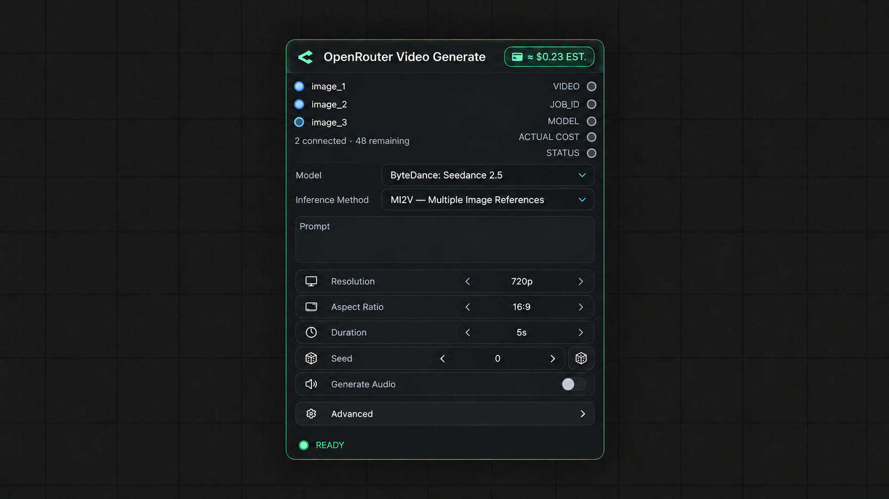
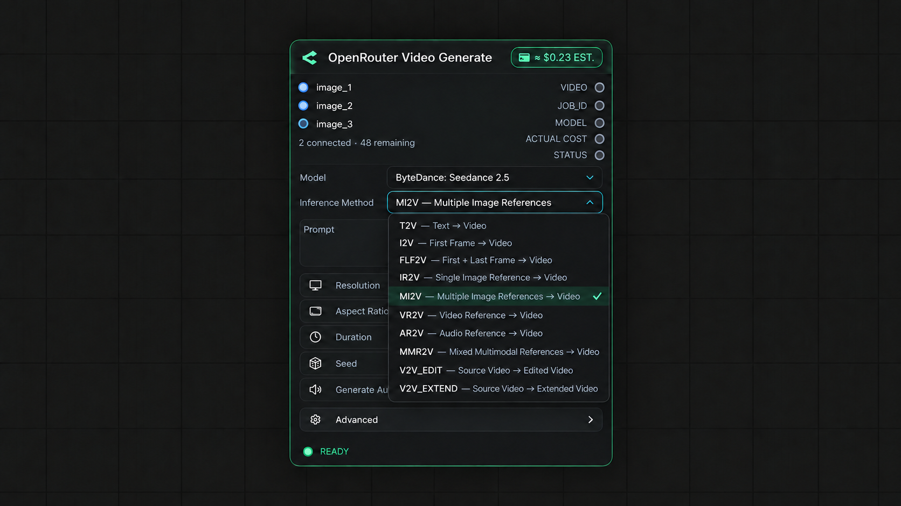
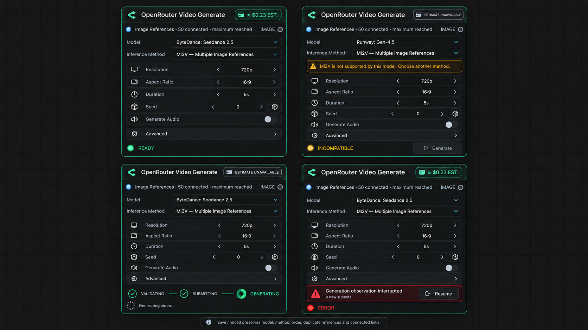

# Phase 10 Direction 3 Visual Specification

- Status: `PRODUCT DIRECTION APPROVED — VISUAL ACCEPTED AFTER SHORT-LABEL CORRECTION`
- Visual direction: `Direction 3 — balanced native/polished ComfyUI`
- Primary model state: `bytedance/seedance-2.5`
- Primary method state: `MI2V`
- Implementation authorization: `GRANTED — PRODUCT CODE NOT YET STARTED`

Raster mockups are visual targets. This document is the exact semantic source if generated text in a
mockup ever differs from the specification.

## Approved visual targets

### Primary MI2V state



### Full Inference Method menu



### Maximum, incompatible, lifecycle, error, and Resume states



## Node hierarchy

The main control order is fixed:

```text
Model
Inference Method
Prompt
Resolution / Aspect Ratio
Duration
Seed / Generate Audio
Advanced
```

Inputs stay above the widget stack, outputs stay on the right, the cost badge stays in the header,
and the presentation lifecycle stays at the bottom. Idle lifecycle is hidden.

The main node must not show development or transport noise: no `PUBLIC HTTPS URL`, catalogue
timestamp, raw capability rows, debug state rows, `OUTPUT GEOMETRY`, or `DURATION MODE`.

## Method selector

With no model, the control is disabled and reads `Select model first`. After the first model choice on
a genuinely new node, the product preference is applied. For Seedance 2.5 this is `MI2V`.

The Seedance 2.5 dropdown contains exactly:

```text
T2V — Text → Video
I2V — First Frame → Video
FLF2V — First + Last Frame → Video
IR2V — Single Image Reference → Video
MI2V — Multiple Image References → Video
VR2V — Video Reference → Video
AR2V — Audio Reference → Video
MMR2V — Mixed Multimodal References → Video
V2V_EDIT — Source Video → Edited Video
V2V_EXTEND — Source Video → Extended Video
```

## Method-specific visible sockets

| Method | Visible sockets | Local validity |
| --- | --- | --- |
| `T2V` | none | prompt-to-video |
| `I2V` | `first_frame` | exactly one required |
| `FLF2V` | `first_frame`, `last_frame` | both required |
| `IR2V` | `image_1` | exactly one IMAGE reference |
| `MI2V` | `image_1…image_N` | at least two IMAGE references |
| `VR2V` | `video_1…video_N` | at least one VIDEO reference |
| `AR2V` | `audio_1…audio_N` | at least one AUDIO reference |
| `MMR2V` | connected `image_N` / `video_N` / `audio_N`; free `reference_N` | at least two refs and two distinct kinds |
| `V2V_EDIT` | `source_video`, optional short typed references | source required; intent EDIT |
| `V2V_EXTEND` | `source_video`, optional short typed references | source required; intent EXTEND |

Socket labels use compact lowercase snake_case. Reference-slot numbering is stable, one-based, and
follows visible serialization order. In MMR2V an unconnected trailing socket is `reference_N`; after a
typed connection it becomes `image_N`, `video_N`, or `audio_N` without moving the socket. These labels
are presentation semantics only and never become upstream field names.

Transport is expressed by the helper nodes `Public Image URL`, `Public Video URL`, and
`Public Audio URL`; the Generate node remains task-oriented.

## Autogrow

- Exactly one free trailing socket is visible while capacity remains.
- Connecting Reference N creates Reference N+1.
- At the model limit, the free trailing socket disappears and the summary reads `maximum reached`.
- No connected link is ever deleted or reordered automatically.
- MI2V shows the second socket after the first connection but remains invalid until two IMAGE inputs
  are connected.
- MMR2V remains invalid until both count and distinct-kind minima are satisfied.
- Source Video consumes one slot in V2V modes.

The compact summary format is `<connected> connected · <remaining> remaining`; at the limit it is
`<connected> connected · maximum reached`.

## Switching and incompatible state

If a model switch makes the selected method incompatible, the selected method and all links remain
visible. An amber inline message explains the incompatibility, the bottom state is `INCOMPATIBLE`,
and Generate is blocked. No automatic fallback or link deletion occurs.

If changing the method would orphan connected media, reject the change in place and show a short
reason. The user must explicitly disconnect or choose a compatible path.

## Lifecycle presentation

| Durable Core state | UI presentation |
| --- | --- |
| `VALIDATING` | `VALIDATING` |
| `SUBMITTING` | `SUBMITTING` |
| `ACCEPTED`, `POLLING` | `GENERATING` |
| `DOWNLOADING` | `DOWNLOADING` |
| `DONE` | `DONE` |
| terminal failure | `ERROR` |

`GENERATING` is presentation only. The durable lifecycle is unchanged. Resume is a secondary action
in interrupted/error observation states and visibly communicates that it creates `0 new submits`.

## Cost badge

- Show `≈ $X.XX EST.` only for an unambiguous matching pricing contract.
- Show `ESTIMATE UNAVAILABLE` for incompatible or structurally ambiguous requests.
- A video-reference or Source Video topology does not reuse the base T2V estimate.
- On `DONE`, show actual reported cost separately from the pre-submit estimate.

## Error and persistence states

Errors use one concise human message, a stable error state, and a clear next action. Validation errors
identify the missing topology condition before submit. Observation interruption offers Resume without
implying generation failure.

Save/reload preserves model, explicit method, reference order, duplicate references, Source Video
role, and all connected links. A saved incompatible state reloads as incompatible; it is never silently
rewritten to the preferred method.

## Visual acceptance

The Product Owner accepted Direction 3 with one final correction: replace long typed reference labels
with the compact `image_N`, `video_N`, and `audio_N` convention. The updated primary and dropdown
assets satisfy that condition. The Phase-10 visual gate is closed and implementation may proceed
without reopening design direction.
